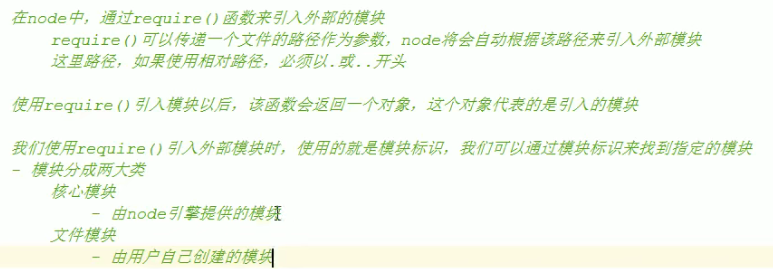

前端JS：与浏览器交互

后端Node.js：在服务器（和系统进行交互）端运行JS、跨平台


> Node是对ES标准一个实现，Node 也是一个JS引擎通过Node 可以使 JS 代码在服务器端执行
>
> Node仅仅对ES标准进行了实现，所以在Node中不包含DoM和BOM
>
> Node 中可以使用所有的内建对象
>
> string Number Boolean Math Date RegExp Function object Array
>
> 而BoM和DOM都不能使用
>
> 但是可以使用console 也可以使用定时器( setTimeout ()     setInterval() )
>
> 
>
> Node可以在后台来编写服务器
>
> Node编写服务器都是**单线程**的服务器
>
> - 进程
>
>   进程就是一个一个的工作计划（工厂中的车间)
>
> - 线程
>
>   线程是计算机最小的运算单位（工厂中的工人)
>   线程是干活的
>
> 传统的服务器都是多线程的
>
> - 每进来一个请求，就创建一个线程去处理请求
>
> Node的服务器单线程的
>
> - Node处理请求时是单线程，但是在后台拥有一个 I/O 线程池


WebStorm 软件

> WS 的安装用法 https://blog.csdn.net/sinat_38992528/article/details/80626678


### 模块化


- Node 中，一个 JS 文件就是一个 模块
- Node 中，每一个 JS 文件中的 JS 代码都是独立运行在一个函数中，而不是全局作用域，所以一个模块中的变量和函数在其它模块中无法访问


向外部暴露属性或方法 **exports.**

```js
var x = 'mmmmm1';
var y = 'm11111';


function f() {
    console.log('f');
}

exports.f = f;//暴露函数
exports.a = 'engureguo';//暴露属性
exports.x = x;
```

```js
var m1 = require('./01.m.js');

console.log(m1);
//{ f: [Function: f], a: 'engureguo', x: 'mmmmm1' }
```


 


**核心模块：服务器级别的API，被封装到包中**

- fs             文件系统工具包
- http           服务器工具包
- path       处理路径相关
- os                      查看CPU、内存、用户等信息
- ...


核心模块引入

- node引擎提供的模块
- 核心模块标识，就是模块的名字

```js
var fs = require('fs');
```


文件模块

- 相对路径，**以 .  或 .. 开头**
- 绝对路径


> **全局对象 global**，保存全局的 属性和方法


创建全局变量：

```
a = 0;

global.x = 1;

```


> 验证：一个JS文件独立运行在一个函数中，而不是全局作用域，别的模块无法访问

```js
console.log(arguments);//函数入参

console.log(arguments.callee);//当前执行的函数对象
console.log(arguments.callee + "");//查看函数实现

------------------------

function (exports, require, module, __filename, __dirname) {

var m1 = require('./01.m.js');

console.log(arguments);
console.log(arguments.callee + "");

}

```


**实际上模块中的代码都是包装在一个函数中执行的，并且在函数执行时传递进了五个实参（global.arguments）**

| arguments  | 含义                                                         | index |
| ---------- | ------------------------------------------------------------ | ----- |
| exports    | 该对象用来将变量或函数暴露到外部                             | 0     |
| require    | 函数，用来引入外部的模块                                     | 1     |
| module     | 代表当前模块本身，exports是module的属性。<br />module.exports = exports，也可以 module.exports 导出 | 2     |
| __filename | 模块绝对路径                                                 | 3     |
| __dirname  | 模块所在文件夹                                               | 4     |

```
[Arguments] {
  '0': {},
  
  '1': [Function: require] {
    resolve: [Function: resolve] { paths: [Function: paths] },
    main: Module {
      id: '.',
      path: 'C:\\Users\\HiWin10\\Desktop\\notes\\其他\\node.js\\code-ws',
      exports: {},
      parent: null,
      filename: 'C:\\Users\\HiWin10\\Desktop\\notes\\其他\\node.js\\code-ws\\demo.js',
      loaded: false,
      children: [Array],
      paths: [Array]
    },
    extensions: [Object: null prototype] {
      '.js': [Function (anonymous)],
      '.json': [Function (anonymous)],
      '.node': [Function (anonymous)]
    },
    cache: [Object: null prototype] {
      'C:\\Users\\HiWin10\\Desktop\\notes\\其他\\node.js\\code-ws\\demo.js': [Module],
      'C:\\Users\\HiWin10\\Desktop\\notes\\其他\\node.js\\code-ws\\01.m.js': [Module]
    }
  },
  
  '2': Module {
    id: '.',
    path: 'C:\\Users\\HiWin10\\Desktop\\notes\\其他\\node.js\\code-ws',
    exports: {},
    parent: null,
    filename: 'C:\\Users\\HiWin10\\Desktop\\notes\\其他\\node.js\\code-ws\\demo.js',
    loaded: false,
    children: [ [Module] ],
    paths: [
      'C:\\Users\\HiWin10\\Desktop\\notes\\其他\\node.js\\code-ws\\node_modules',
      'C:\\Users\\HiWin10\\Desktop\\notes\\其他\\node.js\\node_modules',
      'C:\\Users\\HiWin10\\Desktop\\notes\\其他\\node_modules',
      'C:\\Users\\HiWin10\\Desktop\\notes\\node_modules',
      'C:\\Users\\HiWin10\\Desktop\\node_modules',
      'C:\\Users\\HiWin10\\node_modules',
      'C:\\Users\\node_modules',
      'C:\\node_modules'
    ]
  },
  
  '3': 'C:\\Users\\HiWin10\\Desktop\\notes\\其他\\node.js\\code-ws\\demo.js',
  
  '4': 'C:\\Users\\HiWin10\\Desktop\\notes\\其他\\node.js\\code-ws'
}
```


> module.exports 与 exports 的区别


module.exports 可以实现 exports 的功能，还可以：

```js
module.exports {
    name: 'engure',
    age: 22,
	say: function() {}
}
```


> 栈内存和堆内存
>
> ```js
> var a = xxx;
> var b = a;
> b++;
> a ? b
> ```
>
> 基本数据类型保存的数据相互独立，区别于引用类型


> exports 指向 module.exports
>
> `exports = { } 相当于 exports = new Object();` 相当于修改了指向，是错误的用法


总结：

- 通过 exports 只能使用 `.`  的方式向外部暴露对象
- 通过 module.exports 既可以通过 `.` 的方式，有可以通过直接赋值 `{}`

> 问题：以上是讲师所讲内容，在我的机器上 node 14.17.1，可以通过 exports = {} 进行赋值
>
> 实验总结：两者的关系是开始时指向同一个对象，是引用类型，如果其中之一又创建了对象（={}，或 =new Object()），那么两者指向不同
>
> 版本问题？


### 包


 


> package.json，包的描述信息

**dependencies** 依赖的包

**description**

**devDependencies** 开发依赖，开发环境，区别于生产环境

**directories** 

**dist**

**licence**

**homepage**

**maintainers**

**repository**

**name** 模块标识

...

 

> json 文件不能写注释


### NPM 包管理器

Node Package Manager

 

> npm -v
>
> npm version
>
> npm search 包名
>
> npm install 包名（install 可以简写为 `i`）
>
> npm init 
>
> npm remove 包名 （remove 可以简写为 `r`）
>
> ⭐ npm install 包名 --save（安装包并安装到依赖中，--save 可简写为 `-S`）安装的同时将包设置在 `dependencies` 中，记录依赖包和他的版本，push到git上时不传 `node_modules/` 中的内容
>
> ⭐ npm install  安装依赖，自动根据版本下载包
>
> npm install   -g  包名     全局安装，一般都是一些工具


> 如何在一个指定的目录下使用一个 npm 上的包比如 math？

1. 初始化包 `npm init`   （一路回车，**包名不允许大写**）
2. 安装 math 包 `npm install math` 此时 math 被安装到 `node_modules` 中
3. 创建 index.js，引用并使用，运行 `node index.js`

```js
var math = require('math');

console.log(math.add(100, 200));
```


### CNPM

下载大包很慢，使用淘宝镜像，China NPM


```python
npm install -g cnpm --registry=https://registry.npm.taobao.org
```


cnpm 命令和 npm 一样

```
cnpm i express -S
```


 

看到下载的文件保存方式和原来的 npm 保存方式不一样。

使用快捷方式指向包的方式，避免两者的冲突


> node 搜索包的流程？⭐

node 使用模块名字来引入模块时，首先在当前目录的 node_modules 下寻找，如果找不到会去上一级继续找，如果没有则继续向上找，一直找到根目录，如果找不到则报错


