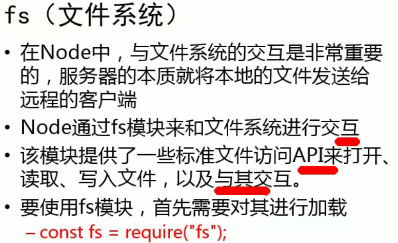

### Buffer

和数组很像，操作方法也相似

与数组不同的是，它能够存储**二进制数据**

不需要引入，**Node自带，直接用**


```js
var str = 'Hello Engure!';

//将一个字符串保存到buffer中，
var buf = Buffer.from(str);

console.log(buf);
//<Buffer 48 65 6c 6c 6f 20 45 6e 67 75 72 65 21>
//范围 00~ff, 0000-0000 ~ 1111-1111，以字节为单位

```


buffer 占用的内存：buffer长度个字节


一个汉字占用 3 个字节

```js
//<Buffer e7 9b 96 e7 89 b9>
console.log(Buffer.from('盖特'));
```


> Buffer 简单使用

所有构造方法都已经废弃了

**Buffer.alloc(size)**

Buffer大小一旦分配，其长度固定不变，是对内存进行直接操作。（区别于数组）

```js
//数组越界：自动分配空间
var arr = [1,2,3];
arr[5] = 5;
console.log(arr);
//[ 1, 2, 3, <2 empty items>, 5 ]
```


赋值&取值

```js
var buf = Buffer.alloc(10);
buf[0] = 88;
buf[1] = 255;//ff
buf[2] = 0xaa;
buf[3] = 450;//超过255会取低8位

//查看内容
buf[2]    //默认10进制
buf[2].toString(16);  //16进制内容
buf[2].toString(2);   //2进制

//循环
for (var i=0;i<buf.length;i++) {
    console.log(buf[i].toString(16));
}
```


**Buffer.allocUnsafe(size)**

区别于 alloc()，allocUnsafe() 申请的内存是不干净的

```js
console.log(Buffer.alloc(10));//<Buffer 00 00 00 00 00 00 00 00 00 00>
console.log(Buffer.allocUnsafe(10));//<Buffer 00 00 00 00 00 00 00 00 d8 7d>
```


比较

| 申请函数          | 特点                                                 |
| ----------------- | ---------------------------------------------------- |
| alloc(size)       | 获取的buffer内容都是清理干净的；效率较低             |
| allocUnsafe(size) | 可能包含内存中的“敏感数据”，是不安全的；但是效率更高 |


**buffer.toString()**

将 buffer 转化为字符串，可以查看其中的内容

```js
console.log(buf.toString());//转为字符串类型
```


更多

> buffer 缓冲区  http://nodejs.cn/api/buffer.html


### fs

文件系统 File System，通过 Node 操作文件

 


**fs 是核心模块，不需要下载，需要引入**

**同步和异步的操作性形式**

 

同步和回调


#### **同步文件写入**


> 打开文件

`fs.openSync(path,  flags   [,   mode])`

- path
- flags      打开类型，只读 `r`、 `w`
- mode    设置文件权限，一般不传，多用于 linux


> 写入文件

`fs.writeSync(fd,   string   [,  position  [, encoding] ])`

- fd    文件标识
- string     写入内容
- position   写入的起始位置
- encoding    写入编码，默认 UTF-8


> 关闭文件描述 ⭐

`fs.closeSync(fd)`


注意：同步文件写入从上到下执行，需要处理异常


#### **异步文件写入**


> 打开文件

`fs.open(path,  flags  [, mode],  callback)`

参数和同步的差不多，多了一个 `callback`

⭐异步函数没有返回值，返回值都是通过回调函数参数返回的

⭐回调函数参数：

1. err 错误对象，如果没有错误则为null
2. fd   文件的描述符

```js
fs.open('data.txt', 'r', function (err, fd) {
    if (err != null) {//出错
        console.log(err);
    } else {
        console.log(fd);
    }
})
```


> 写入文件

`fs.write(fd， string [, position [, encoding]], callback)`


```js
var fs = require('fs');

fs.open('data.txt', 'w', function (err, fd) {
    if (err != null) {//出错
        console.log(err);
    } else {
        fs.write(fd, 'HELLO啊小晶子!', function (err) {
            if (err == null) {
                console.log('写入成功~~');
            }
            
        })
    }
});
```


> 关闭文件

`fs.close(fd, callback)`

回调只有一个 err 参数

```js
var fs = require('fs');

fs.open('data.txt', 'w', function (err, fd) {
    if (err != null) {//出错
        console.log(err);
    } else {
        fs.write(fd, 'HELLO啊小晶子!', function (err) {
            if (err == null) {
                console.log('写入成功~~');
            }

            //写入完成，关闭fd
            fs.close(fd, function (err) {
                if (!err) {
                    console.log("文件已经关闭~~");
                }
            })
        })
    }
});
```


同步：符合人类思维，较为简单

异步：不会阻塞程序的执行，性能更好，较为复杂，有一定难度


#### **简单文件写入**


封装

```
fs.writeFile(file, data[, options], callback)
fs.writeFileSync(file, data[, options])
```

- file     路径，绝对路径或者相对路径
- data    需要写入的数据
- **options 对象**
  - encoding    编码方式
  - mode   文件权限
  - flag    文件操作类型，默认 w


异步

```js
var fs = require('fs');
fs.writeFile('f3.txt', '简单文件写入~~', function (err) {
    if (!err) {
        console.log('写入成功~~~');
    }
});
```


options 对象

```js
var fs = require('fs');
fs.writeFile('f3.txt', '简单文件写入~~', {flag:"a"}, function (err) {
    if (!err) {
        console.log('写入成功~~~');
    }
});
```


文件操作类型

 

常用：`r`、`w`、`a`


同步

```js
```


#### **流式文件写入**


> **注意**
>
> 同步、异步、简单的文件写入：不适合**大文件操作**
>
> 缺点：性能差，容易导致内存溢出


> 写入文件


`fs.createWriteStream(path  [, options])`

用来创建一个可写流

- path    文件路径
- options             配置的参数，是一个对象


```js
var fs = require('fs');

var ws = fs.createWriteStream('f5.txt');

ws.write('1.node.js\n');
ws.write('2.npm\n');
ws.write('3.cnpm\n');
```


> 事件绑定

> 触发多次：使用 `on(事件字符串，回调函数)`
>
> 触发一次：使用 `once(事件字符串，回调函数)`


```js
var fs = require('fs');

var ws = fs.createWriteStream('f5.txt');

//事件触发一次，使用once绑定
ws.once('open', function () {
    console.log("打开流~~");
});
ws.once('close', function () {
    console.log("关闭流~~");
});

//可以多次写入
ws.write('1.node.js\n');
ws.write('2.npm\n');
ws.write('3.cnpm\n');

//关闭流，注意而不是 ws.close()
ws.end()
```


流用于写大文件


**文件读取**


> 1. 同步文件读取
> 2. 异步文件读取
> 3. 简单文件读取
> 4. 流式文件读取


#### **简单文件读取**


``fs.readFile(path[, options], callback)``

- callback    回调函数，参数：
  - err      错误
  - data    读取的内容，是一个Buffer（考虑到二进制文件的读取）

`fs.readFileSync(path[, options])`


```js
var fs = require("fs");

fs.readFile('data.txt', function (err, data) {
    if (!err) {
        console.log(data);//二进制数据
    }
});
```


将读取内容写入到另一文件：

```js
var fs = require("fs");

fs.readFile('data.txt', function (err, data) {
    if (!err) {
        //console.log(data.toString());
        //将读取的文件写入另一个文件
        fs.writeFile("data2.txt", data, function (err) {
            if (!err) {
                console.log("文件写入成功~~");
            }
        });
    }

});
```


#### 流式文件读取


适用于大文件读取，可以分多次将文件读取到内存中


`fs.createReadStream(path[, options])`


读取可读流中的数据，需要为流绑定一个关闭一个 data 事件，事件绑定完成后会自动读取数据

读取完之后，自动关闭流


```js
var fs = require("fs");

var path = "C:\\Users\\HiWin10\\Music\\白羊.mp3";

var rs = fs.createReadStream(path);

rs.once('open', function () {
    console.log("打开流~~");
});

rs.once('close', function () {
    console.log("关闭流~~");
});

//绑定data事件，当打开流时会自动读取（分多次），读完后会触发close事件关闭流
rs.on('data', function (data) {
    console.log(data.length, data)
});
```

```
打开流~~
65536 <Buffer 49 44 33 03 00 00 00 00 00 23 54 53 53 45 00 00 00 0f 00 00 00 4c 61 76 66 35 37 2e 37 31 2e 31 30 30 00 00 00 00 00 00 00 00 00 00 00 ff fb 90 00 00 ... 65486 more bytes>
65536 <Buffer 87 43 e4 d1 f8 0a d7 90 d3 01 6b b6 9a 6d e3 3d 3f 34 8a 47 25 3c 15 a2 b8 87 a6 b4 18 ee 3c d6 7f ff b6 b5 00 00 00 2e 59 6b 64 00 63 e7 60 26 a0 02 ... 65486 more bytes>

...

65536 <Buffer bf fd 5f bb f2 35 02 05 e3 8c ef 6d ff 7e aa 07 10 bf c2 84 8d 30 54 81 81 dc eb d0 b5 81 40 cb d3 e8 22 da 46 7a 48 52 b2 14 b0 cc 14 e8 45 a7 47 a9 ... 65486 more bytes>
65536 <Buffer 5b 22 1a 22 6f ae 45 7e a2 4d a0 20 c5 09 37 9c 79 55 da 4a 62 a9 bc 06 a3 4b 89 92 04 01 d1 52 6d cd fa 7a 2c cf 28 e6 ab 98 1b e2 2e a4 db 92 bd 9d ... 65486 more bytes>
65536 <Buffer 33 dc e5 00 01 82 12 51 25 03 1c 0d 8d bc c2 32 a2 4c d8 04 92 f8 98 37 fe 67 85 71 8a 83 2b 1c b3 49 ba 61 92 b1 fd ca a1 c5 25 ea ff fb 92 64 c2 80 ... 65486 more bytes>
8904 <Buffer 76 f3 f7 7f d3 7e ac c5 75 33 e8 17 38 c9 08 33 d1 db 37 78 40 20 12 62 a0 1d 83 20 25 61 86 5e fa b4 d0 fe 76 ea b5 2e 86 2b 0f 7a df 36 cd d3 de f5 ... 8854 more bytes>
关闭流~~
```


#### 将读取的文件写入文件


```js
var fs = require("fs");

var path = "C:\\Users\\HiWin10\\Music\\白羊.mp3";

var rs = fs.createReadStream(path);

var ws = fs.createWriteStream('by.mp3')

//////////////

rs.once('open', function () {
    console.log("读流打开~~");
});

rs.once('close', function () {
    console.log("读流关闭~~");
    //读流关闭时，要顺带关闭写流
    ws.end()
});

ws.once('open', function () {
    console.log("写流打开~");
});

ws.once('close', function () {
    console.log("写流关闭~");
});

////////////////////

//读流自动读取数据，写入写流，完事后读流自动关闭，顺带关闭写流
rs.on('data', function (data) {
    ws.write(data)
});
```

```
读流打开~~
写流打开~
读流关闭~~
写流关闭~
```


#### 使用 pipe() 读写文件


使用 `pipe()` **自动**将读流与写流相关联，完成后**自动关闭**两者


```js
var fs = require("fs");

var path = "C:\\Users\\HiWin10\\Music\\白羊.mp3";

var rs = fs.createReadStream(path);

var ws = fs.createWriteStream('by2.mp3')

//////////////

rs.once('open', function () {
    console.log("读流打开~~");
});

rs.once('close', function () {
    console.log("读流关闭~~");
});

ws.once('open', function () {
    console.log("写流打开~");
});

ws.once('close', function () {
    console.log("写流关闭~");
});

////////////////////

rs.pipe(ws);
```


不加监听事件

```js
var fs = require("fs");
var path = "C:\\Users\\HiWin10\\Music\\白羊.mp3";

var rs = fs.createReadStream(path);//读流

var ws = fs.createWriteStream('by2.mp3');//写流

rs.pipe(ws);

```


> 服务器对请求的读取和写入就是一个流


#### 其他内容


> 文件是否存在

`fs.existsSync(path)` 同步方法（异步方法复杂，已经废弃，不推荐）


> 获取文件信息

`fs.stat(path, callback)`

`fs.statSync(path)`


```js
fs.stat("by.mp3", function () {
    console.log(arguments);
    /*
        [Arguments] {
            '0': null,
            '1': Stats {
                dev: 3430564453,
                mode: 33206,
                nlink: 1,
                uid: 0,
                gid: 0,
                rdev: 0,
                blksize: 4096,
                ino: 13229323905605598,
                size: 2695880,
                blocks: 5272,
                atimeMs: 1630205411961.7207,
                mtimeMs: 1630205383196.9993,
                ctimeMs: 1630205397322.6138,
                birthtimeMs: 1630205383184.0247,
                atime: 2021-08-29T02:50:11.962Z,
                mtime: 2021-08-29T02:49:43.197Z,
                ctime: 2021-08-29T02:49:57.323Z,
                birthtime: 2021-08-29T02:49:43.184Z
                }
        }
     */
});
```

可以推断

```js
fs.stat('by.mp3', function (err, stat) {
    if (!err) {
        console.log(stat);
    }
});
```

`fs.Stats` 类  http://nodejs.cn/api/fs.html#fs_class_fs_stats)

- `stats.isDirectory()`
- `stats.isFile()`
- `stats.isSocket()`
- `stats.size`
- `stats.mtimeMs`  最后一次修改时间
- `stats.birthtimeMs` 创建时间


> 删除文件

`fs.unlink(path, callback)`

`fs.unlinkSync(path)`

删除文件与磁盘的连接


> 目录读取

`fs.readdir(path [, options], callback)`

`fs.readSync(path [, options])`


```js
fs.readdir('.', function (err, files) {
    if (!err) {
        console.log(files);//数组
    }
});
```


> 文件截断

`fs.truncate(path, len, callback)`

`fs.truncate(path, len)`

- len     截断 >= len 字节的内容


> 创建目录

`fs.mkdir(path [, mode], callback)`

`fs.mkdirSync(path [, mode])`


> 删除目录

`fs.rmdirSync(path)`

`fs.rmdir(path, callback)`


> 文件重命名

`fs.rename(oldPath,  newPath,  callback)`

`fs.rename(oldPath, newPath)`

```js
fs.rename('by.mp3', 'by1.mp3', function (err) {
    if (!err){
        console.log("修改成功！");
    }
});
```


不同目录下，文件移动功能

```js
//不同目录下，类似文件移动功能
fs.rename('by.mp3', 'F:/by1.mp3', function (err) {
    if (!err){
        console.log("修改成功！");
    }
});
```


> 文件的监视

`fs.watchFile(filename [, options],  listener)`


```js
fs.watchFile('f5.txt', function (cur, pre) {
    //console.log(arguments);
    //cur 当前的Stats
    //pre 之前的Stats
    console.log(pre.size, '->', cur.size);
});
```


设置 `options.interval` 属性，配置轮询频率

```js
fs.watchFile('f5.txt', {interval: 100}, function (cur, pre) {
    console.log(pre.size, '->', cur.size);
});
```

注意：如果设置的太小很消耗性能


