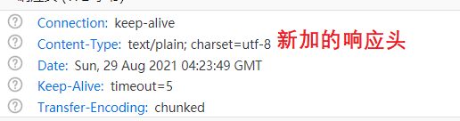
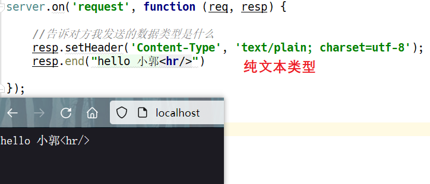
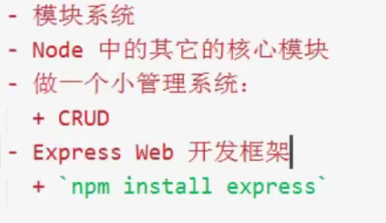

### http


```js
var http = require('http');

var server = http.createServer();

//注册request请求事件
server.on('request', function () {
    console.log(arguments)
});

//启动服务器，需要绑定端口号
server.listen(80, function () {
    console.log("server starting...");
});
```


请求处理

```js
//注册request请求事件，回调函数需要接受两个参数
//  Request对象，获取客户端的一些信息，比如URL
//  Responce对象，用来给用户发送响应消息
server.on('request', function (req, resp) {
    console.log('请求路径 = ' + req.url);


    //write可以多次，必须以end结束，告诉给客户端写入已经结束了
    resp.write('<h1>hello node.js.</h1>');
    resp.end();
});
```


`req.url`

都是以 `/` 开头，是用户请求的路径

可以根据请求路径 `req.url` 响应不同的内容

```js
server.on('request', function (req, resp) {
    console.log('请求路径 = ' + req.url);

    //区别对待不同的请求
    if (req.url == '/' || req.url == '/index.html' || req.url == '/index') {
        //主页
        resp.write('<h1>index</h1>');
    } else if (req.url == '/hello') {
        //hello页
        resp.write('<h2>hello bro!</h2>');
    } else {
        //404
        resp.write('<h1>page not found</h1>');
    }
    
    resp.end();
});
```

> js 中字符串的比较 https://www.w3school.com.cn/js/js_strings.asp


> Response 中的 Content-Type ⭐⭐

告诉客户端发送的内容类型

```js
server.on('request', function (req, resp) {

    //告诉对方我发送的数据类型是什么
    resp.setHeader('Content-Type', 'text/plain; charset=utf-8');
    resp.end("hello 小郭")

});
```



> Content-Type 有哪些类型，表示哪些文件 https://www.runoob.com/http/http-content-type.html

> Content-Type 默认类型是什么？`text/html`，会解析响应的html元素
>
> 如果是 `text/plain` 表示纯文本类型，默认不会解析html元素
>
>   


> 发送网页

```js
server.on('request', function (req, resp) {

    if (req.url == '/') {
        //发送html文件
        fs.readFile("index.html", function (err, data) {
            if (err) {
                resp.setHeader('Content-Type', 'text/plain; charset=utf-8');
                resp.end("文件不存在，请重试")
            } else {
                resp.setHeader('Content-Type', 'text/html; charset=utf-8');
                resp.end(data)//参数可以是字符串也可以是Buffer，这里data是Buffer类型
            }
        });

    }
});
```


> 发送图片

```js
server.on('request', function (req, resp) {

    if (req.url == '/') {
        //告诉对方我发送的数据类型是什么
        resp.setHeader('Content-Type', 'text/html; charset=utf-8');
        resp.write("hello 小郭<hr/>")
        resp.write("<image src='/img' />");
        resp.end()

    } else if (req.url == '/img') {
        //发送图片
        resp.setHeader('Content-Type', 'image/jpeg;');//二进制文件（图片、音频）不需要指定编码

        var rs = fs.createReadStream('5.jpg');
        rs.once('close', function () {
            resp.end()//真正关闭resp写入
        });
        rs.on('data', function (data) {
            resp.write(data)
        });

        //resp.end()异步操作，出错！Error [ERR_STREAM_WRITE_AFTER_END]: write after end
    }
});
```


> 踩坑记录：[node http fs.createReadStrem 发送文件 Error ERR_STREAM_WRITE_AFTER_END\]: write after end_Engure-CSDN博客](https://blog.csdn.net/qq_43341057/article/details/119979359)


> 关于设置 Content-Type：
>
> **不同类型**：
>
> | 类型        | Content-Type              |
> | ----------- | ------------------------- |
> | 纯文本 .txt | text/plain; charset=utf-8 |
> | html, htm   | text/plain; charset=utf-8 |
> | .xml        | text/xml                  |
> | .jpg        | image/jpeg                |
> | .png        | image/png                 |
> | .gif        | image/gif                 |
> | json格式    | application/json          |
> | .pdf        | application/pdf           |
> | .word       | application/msword        |
>
> **编码类型**：
>
> - 对于二进制数据，不需要设置 charset
> - 对于文本类型数据 text/* ，需要设置 charset


[后续]




