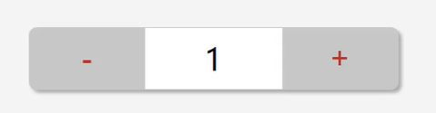
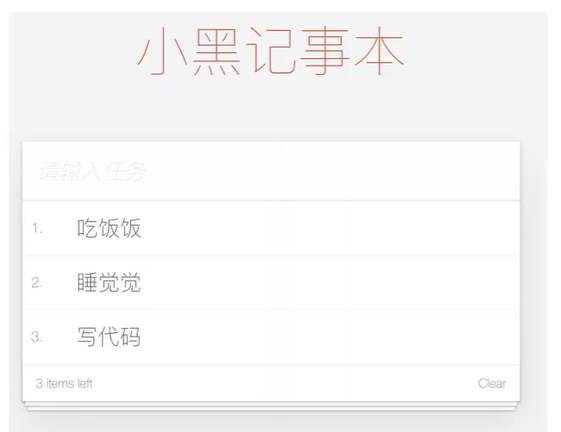
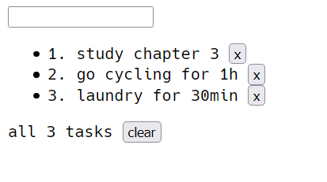

黑马课程：

https://www.bilibili.com/video/BV12J411m7MG

---


### Vue简介

【唯有】

**Vue 特点：**

1. JavaScript框架
2. 简化Dom操作
3. 响应式数据驱动

[介绍 — Vue.js (vuejs.org)](https://cn.vuejs.org/v2/guide/)

**引入依赖，第一个程序：**

```html
<div id="app">
  {{ message }}
</div>

<script src="https://cdn.jsdelivr.net/npm/vue/dist/vue.js"></script>
<script>
    var app = new Vue({
      el: '#app',
      data: {
        message: 'Hello Vue!'
      }
    })
</script>
```


**el：挂载点，挂载 vue 实例**

> 1. Vue实例的作用范围是什么？
>
>    Vue会管理el选项**命中的元素**及其内部的**后代元素**
>
> 2. 是否可以使用其他选择器？
>
>    可以使用其他选择器（类、标签），但是建议使用ID选择器
>
> 3. 是否可以设置其他的dom元素呢？
>
>    可以使用其他的**双标签**，不能使用HTML和BODY标签

**data：数据对象**

> 1. Vue中用到的数据定义在data中
> 2. data中可以写**复杂类型**的数据，比如对象、数组类型
> 3. 渲染复杂类型数据时，遵守**js语法**即可

```html
<div id="app">
    {{ msg }}
    <h2> {{ person.name }} {{ person.age }} </h2>
    <ul>
        <li>{{ tasks[0] }}</li>
        <li>{{ tasks[1] }}</li>
    </ul>
</div>

<script src="https://cdn.jsdelivr.net/npm/vue/dist/vue.js"></script>
<script>
    var app = new Vue({
        el: "#app",
        data: {
            msg: "你好 小黑！",
            person: {
                name: 'engure',
                age: 22
            },
            tasks: ['算法', 'vue', '八股文']
        }
    })
</script>
```


### 本地应用

tasks：

1. 通过Vue实现常见的网页效果
2. 学习Vue指令

#### v-text

```html
<h2 v-text="message"></h2>
```

设置标签的文本值，替换标签中的**全部内容**

指令后可以写表达式：`v-text="message+123"`，注意其中的 **+** 不能省略

> **部分替换**：使用插值表达式 `<h2>msg: {{ msg }}</h2>`
>
> 另外，插值表达式中还可以使用**表达式**，比如 `{{msg + '!'}}` 为字符串拼接

#### v-html

相当于**innerHTML**属性

> 1. v-html指令作用：设置元素的**innerHTML**
> 2. 内容中有**html**结构会被解析为**标签**
> 3. v-text指令无论内容是什么，只会解析**文本**
> 4. 解析文本使用**v-text**，需要解析html结构使用**v-html**

#### v-on

作用：为元素绑定事件

```html
<p id="app" v-on:click="methodName">
    xxxxx
</p>

<script>
	var app = new Vue({
        el:"#app",
        methods: {
            methodName: function(){
                //logic code
            }
        }
    })
</script>
```

> 1. 绑定事件：v-on:click、v-on:mouseenter、v-on:dblclick（双击）
>
> 2. 事件名不用写 **on**
>
> 3. 使用 v-on 的**简写** `@`，比如 v-on:click 相当于 `@click`
>
> 4. 绑定的方法在 **methods** 属性中
> 5. 不用关心 dom 操作，应该重点关注数据的变化，方法中使用 **this** 引用当前实例 **data** 中的数据

#### v-on补充

https://cn.vuejs.org/v2/api/#v-on

**1. 自定义参数**

```html
<div id="app">
    <input type="button" value="click" @click="me(100,'this-is-a-string')" />
</div>

<script>
    var app = new Vue({
        el: "#app",
        methods: {
            me: function(p1, p2) { //定义接受参数
                alert(p1 + ',' + p2)
            }
        },
    })
</script>
```

**2. 事件修饰符**

```html
<div id="app">
    <input @keyup.enter="ok()" /> <!-- 键修饰符.键别名，监听此键的动作 -->
</div>

<script src="https://cdn.jsdelivr.net/npm/vue/dist/vue.js"></script>
<script>
    var app = new Vue({
        el: "#app",
        methods: {
            ok: function() {
                alert('now, ok to your enter!')
            }
        },
    })
</script>
```

使用 `@keyup=method()` 表示监听此元素的键盘事件

> 1. 事件绑定的方法写成 **函数调用** 的形式，即可以传入自定义参数
> 2. 定义方法时需要定义 **形参** 来接收传入的实参
> 3. 时间的后面跟上 **.修饰符** 可以对事件进行限制
> 4. **@keyup.enter** 可以限制出发的按键为回车
> 5. 事件修饰符有多种

####  计数器

实现一个简单的计数器



```html
<div id="app">
    <button @click="sub"><h2>-</h2></button>
    <span v-text="counter"></span>
    <button @click="add"><h2>+</h2></button>
</div>


<script src="https://cdn.jsdelivr.net/npm/vue/dist/vue.js"></script>
<script>
    var app = new Vue({
        el: "#app",
        data: {
            counter: 0
        },
        methods: {
            sub: function() {
                if (this.counter > 0) this.counter--;
                else alert("别减了，到零了！")
            },
            add: function() {
                if (this.counter < 10) this.counter++;
                else alert("别加了，到10了")
            }
        },
    })
</script>
```

> 总结：
>
> 1. 创建Vue实例：**el**（挂载点），data（数据），**methods**（方法）
> 2. v-on指令的作用是绑定事件，简写为 **@**
> 3. 方法中通过 **this**关键字获取 **data** 中的数据
> 4. **v-text** 指令的作用是：设置元素的文本值，简写为 **{{ }}**
> 5. **v-html** 指令的作用是：设置元素的 **innerHTML**

#### v-show

```html
<p v-show="false">
    xxxx（不被显示）
</p>
```

根据表达式的真假，切换元素的显示和隐藏

本质：切换元素的 **display**，`display: none` 表示不显示

指令后的内容可以写表达式，比如 `v-show="age>=18"`

> 1. 作用：根据**真假**切换元素的显示与隐藏，原理是修改元素的display
> 2. 指令后的内容，最终都会被解析为**布尔值**
> 3. 数据变化后，对应元素的显示状态会同步更新

#### v-if

根据表达式的真假，切换元素的显示和隐藏

与 **v-show** 很相似，区别是 **操作 dom 元素**

指令后的内容可以使用表达式，比如 `v-if='temperature>=35'`

> **操作 dom树 比较消耗性能**，因此：
>
> 1. 频繁使用 显示/隐藏 功能的元素 使用 **v-show** 指令
> 2. 不频繁使用的使用 **v-if** 指令

#### v-bind

设计元素的属性，比如 **src, title, class**

使用 **简写 :**  `v-bind:src="" ==> :src=""` 

```html
<div id="app">
    
    <p :class="isActive?'active':''">check check now!</p>
    <!-- 推荐使用对象的方式代替三元表达式 -->
    <p :class="{active:isActive}">check check now!</p>
</div>

<script src="https://cdn.jsdelivr.net/npm/vue/dist/vue.js"></script>
<script>
    var app = new Vue({
        el: "#app",
        data: {
            imgUrl: "./img/a6.png",
            title: "avatar6",
            isActive: true
        }
    })
</script>
```

> 1. **v-bind** 指令作用：为元素绑定属性
> 2. 完整写法：**v-bind:属性名**
> 3. 简写时直接省略 **v-bind**，只保留 **:属性名**
> 4. 需要动态增删 **class** 建议使用对象的方式

#### 图片切换

```html
<div id="app">
    <button @click="prev" v-show="index>0"><h2> prev </h2></button>
    
    <button @click="next" v-show="index<imgs.length-1"><h2> next </h2></button>
</div>

<script src="https://cdn.jsdelivr.net/npm/vue/dist/vue.js"></script>
<script>
    var app = new Vue({
        el: "#app",
        data: {
            index: 0,
            imgs: ['./img/a1.png',
                './img/a2.png',
                './img/a3.png',
                './img/a4.png',
                './img/a5.png',
                './img/a6.png'
            ]
        },
        methods: {
            prev: function() {
                this.index--;
            },
            next: function() {
                this.index++;
            }
        },
    })
</script>
```

> 1. **v-on** 用作事件绑定，简写成 **@**
> 2. **v-bind** 用于设置属性，简写成 **:**
> 3. **v-show** 用于控制 显示与隐藏，与 **v-if** 略有不同
> 4. Vue实例方法中访问 **data** 需要使用 **this** 关键字

#### v-for

```html
<li v-for="item in arr" :title="item">
	{{ item }}
</li>
<!-- 使用索引 -->
<li v-for="(item,index) in arr" :title="item+index">
	{{ index }} {{ item }}
</li>
<!-- 遍历对象数组 -->
<li v-for="(item,index) in objArr" :title="item.name+index">
	{{ index+1 }} {{ item.name }} {{ item.age }}
</li>

<script>
	var app = new Vue({
        el:"#app",
        data:{
            arr:['jack','kavin','kate','randle'],
            objArr:[
                {name:'jor', age:35},
                {name:'rose', age:40}
            ]
        }
    })
</script>
```

> 1. **v-for** 指令的作用：根据数据生成列表结构
> 2. 数组经常和 **v-for** 结合使用
> 3. 语法是 **(item, index) in 数据**
> 4. item 和 index 可以结合其他指令一起使用
> 5. 数组长度的更新会**同步**到页面上，是**响应式**的

#### v-model

获取和设置**表单**元素的值（**双向元素绑定**）

```html
<div id="app">

    <input v-model="msg" />
    <h3>{{ msg }}</h3>

</div>

<script src="https://cdn.jsdelivr.net/npm/vue/dist/vue.js"></script>
<script>
    var app = new Vue({
        el: "#app",
        data: {
            msg: "你好 小黑！"
        }
    })
</script>
```

> 1. **v-model** 指令的作用是便捷的设置和获取 **表单元素** 的值
> 2. 绑定的数据会和表单元素 **值** 相关联
> 3. 绑定的数据 **<—>** 表单元素的值


### 本地记事本




```html
<!DOCTYPE html>

<div id="app">
    <input v-model="newtask" @keyup.enter="keep" />
    <ul>
        <li v-for="(item,index) in tasks">
        	<label> {{ index+1 }}.</label> {{ item }}
            <button @click="del(index)">x</button>
        </li>
    </ul>
    <div v-show="tasks.length != 0">
        <label>all {{tasks.length}} tasks</label>
        <button @click="clear">clear</button>
    </div>
</div>

<script src="https://cdn.jsdelivr.net/npm/vue/dist/vue.js"></script>
<script>
    var app = new Vue({
        el: "#app",
        data: {
            newtask: "",
            tasks: ['study chapter 3', 'go cycling for 1h', 'laundry for 30min']
        },
        methods: {
            keep: function() { // add new task
                if (this.newtask.length != 0) {
                    this.tasks.push(this.newtask);
                    this.newtask = "";
                }
            },
            del: function(index) { // remove tasks[index]
                this.tasks.splice(index, 1) // (start, deleteCount, ..)
            },
            clear: function() { // remove all
                if (this.tasks.length != 0) this.tasks.splice(0)
            }
        },
    })
</script>
```

包含：回车增加、删除某一任务、清空，列表展示，

UI：



> **总结：**
>
> 1. 列表结构可以通过 **v-for** 指令结合数据生成
> 2. **v-on** 结合时间修饰符可以对事件进行限制，比如 **.enter**
> 3. **v-on** 再绑定事件时可以传递自定义参数，比如 `@click=del(index)`
> 4. 通过 **v-model** 可以快速地设置和获取表单元素的值
> 5. 基于 **数据** 的开发方式

