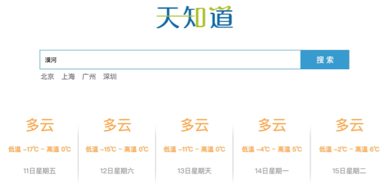
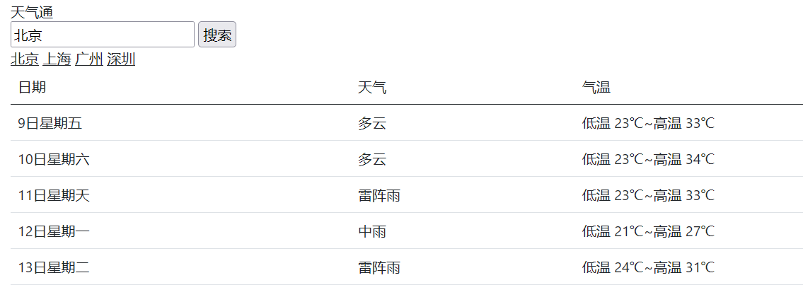

### 网络应用

Vue结合网络数据开发应用

> 1. axios 请求库
> 2. axios+vue
> 3. 天气预报案例


### axios

https://github.com/axios/axios

对 ajax 的封装库

功能强大的网络请求库

```html
<script src="https://unpkg.com/axios/dist/axios.min.js"></script>
```

#### axios.get

```js
axios.get(url?key1=value&key2=value2)
          .then(function(resp){}, function(err){})
```

#### axios.post

```js
axios.post(url, {key1:value2, key2:value2})
		.then(function(resp){}, function(err){})
```

小案例：

```html
<button id='get'>get</button>
<button id='post'>post</button>

<script src="http://ajax.aspnetcdn.com/ajax/jQuery/jquery-1.8.0.js"></script>
<script src="https://unpkg.com/axios@0.21.1/dist/axios.min.js"></script>
<script>
    $('#get').on('click', function() {
        axios.get("https://autumnfish.cn/api/joke/list?num=3").then(
            function(resp) {
                console.log(resp)
            },
            function(err) {
                console.log(err)
            }
        )
    })
    $('#post').on('click', function() {
        axios.post("https://autumnfish.cn/api/user/reg", {
            username: "engure"
        }).then(
            function(resp) {
                console.log(resp)
            },
            function(err) {
                console.log(err)
            }
        )
    })
</script>
```

> 1. **axios** 必须先导入，通过 cdn
> 2. 使用 **get 或 post** 方法就可以放松对应的请求
> 3. **then** 方法中的回调函数会在请求成功或失败时触发（前一个成功方法，后一个是失败方法）
> 4. 通过回调函数的形参可以获取相应内容，或错误信息


### axios+vue

```html
<div id="app">
    <button @click="getJ">获取笑话</button>
    <p> {{ joke }} </p>
</div>

<script src="https://cdn.jsdelivr.net/npm/vue/dist/vue.js"></script>
<script src="https://unpkg.com/axios@0.21.1/dist/axios.min.js"></script>
<script>
    var app = new Vue({
        el: "#app",
        data: {
            joke: "joke to show...."
        },
        methods: {
            getJ: function() {
                var _this = this;
                axios.get("https://autumnfish.cn/api/joke/").then(
                    function(resp) {
                        _this.joke = resp.data
                    },
                    function(err) {
                        _this.joke = err
                    },
                )
            }
        },
    })
</script>
```

> 1. **axios** 回调函数中的 **this** 已经改变，无法访问到 data 中的数据
> 2. 把 **this** 保存起来，回调函数中直接使用保存的 **this** 即可
> 3. 和本地最大的区别就是改变了 **数据来源**


### 天气查询案例



功能：搜索城市回车查询、点击热门城市查询天气


```html
<!DOCTYPE html>
<link href="https://cdn.jsdelivr.net/npm/bootstrap@5.0.2/dist/css/bootstrap.min.css" rel="stylesheet" integrity="sha384-EVSTQN3/azprG1Anm3QDgpJLIm9Nao0Yz1ztcQTwFspd3yD65VohhpuuCOmLASjC" crossorigin="anonymous">

<div id="app" class="container">

    <div class="">天气通</div>

    <div class="">
        <input class="" v-model="city" @keyup.enter="getW" />
        <input class="" type="button" @click="getW" value="搜索" />
    </div>

    <div>
        <a class="link-dark" href="javascript:;" @click="changeC('北京')">北京</a>
        <a class="link-dark" href="javascript:;" @click="changeC('上海')">上海</a>
        <a class="link-dark" href="javascript:;" @click="changeC('广州')">广州</a>
        <a class="link-dark" href="javascript:;" @click="changeC('深圳')">深圳</a>
    </div>

    <div class="">
        <table class="table">
            <thead>
                <td>日期</td>
                <td>天气</td>
                <td>气温</td>
            </thead>
            <tbody>
                <tr v-for="item in data.forecast">
                    <td>{{item.date}}</td>
                    <td>{{item.type}}</td>
                    <td>{{item.low}}~{{item.high}}</td>
                </tr>
            </tbody>
        </table>
    </div>
</div>

<script src="https://cdn.jsdelivr.net/npm/vue/dist/vue.js"></script>
<script src="https://unpkg.com/axios@0.21.1/dist/axios.min.js"></script>
<script>
    var app = new Vue({
        el: "#app",
        data: {
            city: "",
            data: {}
        },
        methods: {
            getW: function() {
                if (this.city.length == 0) return;
                var _this = this;
                axios.get("http://wthrcdn.etouch.cn/weather_mini?city=" + _this.city).then(
                    function(resp) {
                        _this.data = resp.data.data // 此处this的含义，用 a.b.c 获取目标数据
                    },
                    function(err) {
                        _this.data = {}
                    },
                )
            },
            changeC: function(city) {
                this.city = city;
                this.getW() // 通过 this. 调用其他方法
            }
        },
    })
</script>
```



> 1. 自定义参数可以让代码的 **复用性** 更高
> 2. **methods** 中定义的方法内部，可以通过 **this** 关键字点出其他方法 ⭐
> 3. 应用的逻辑代码建议和页面**分离**，使用**单独**的 js文件编写
> 4. **axios** 回调函数中 **this** 指向改变了，需要额外保存一份
> 5. 服务器返回的数据比较复杂是，获取的时候需要注意 **层级** 结构 ⭐