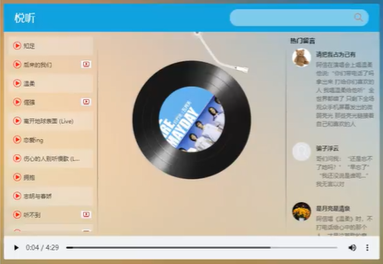
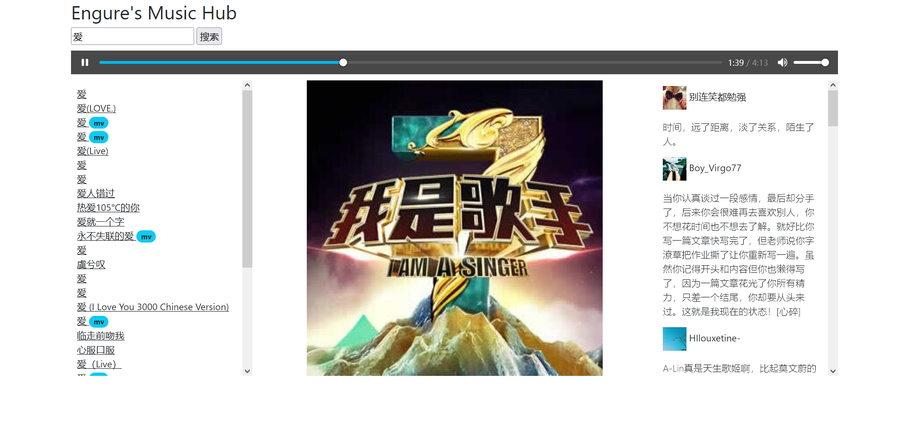

### 综合应用 - 音乐播放器



功能：歌曲搜索、歌曲播放、歌曲封面、歌曲评论、播放动画、mv播放


### 歌曲搜索

> 接口：https://autumnfish.cn/search
>
> 方法：get
>
> 参数：keywords

> 1. 服务器返回的数据比较复杂时，获取的时候要注意 **层级**
> 2. 通过 **审查元素** 快速定位到需要操纵的元素

参考滚动列表：[html列表可滚动_walle的博客-CSDN博客_html滚动列表](https://blog.csdn.net/wuzuyu365/article/details/53911237/)


### 歌曲播放

> 接口：https://autumnfish.cn/song/url
>
> 方法：get
>
> 参数：id（歌曲 id）


### 歌曲封面

> 接口：https://autumnfish.cn/song/detail
>
> 方式：get
>
> 参数：ids（歌曲id）


### 歌曲评论

> 接口：https://autumnfish.cn/comment/hot?type=0
>
> 方法：get
>
> 参数：id（歌曲id，type固定为0）


### 播放动画

> 1. **audio** 标签的 **play** 事件会在音频播放的时候触发，`@play="play"`
> 2. audio 标签的 pause 时间会在音频暂停的时候触发，`@pause="pause"`


### 播放MV

> 接口：http://autumnfish.cn/mv/url
>
> 方法：get
>
> 参数：id（mvid，不为0）

```html
<div class="" v-show="isMvPlaying" style="display: none;">
        <video :src="mvUrl" class="video" controls="controls"></video>
        <div class="mask" @click="isMvPlaying = !isMvPlaying"></div>
</div>
```

编写遮罩层 mask，用于当点击 视频以外的内容时，关闭视频

```css
<style>
    .mask {
        height: 100%;
        width: 100%;
        background: rgba(0, 0, 0, 0.8);
        position: fixed;
        top: 0;
        left: 0;
        z-index: 980;
    }
    
    .video {
        position: fixed;
        width: 800px;
        height: 546px;
        left: 50%;
        top: 50%;
        margin-top: -273px;
        transform: translateX(-50%);
        z-index: 990;
    }
</style>
```


### 做出来的




成品：[朱会会的云播放器 (gitee.io)](https://victor-huihui.gitee.io/2020/03/23/Player/)

**评论区**有很多 接口 和 Vue项目：

https://www.bilibili.com/video/BV12J411m7MG?p=36


---


```html
<!DOCTYPE html>
<link href="https://cdn.jsdelivr.net/npm/bootstrap@5.0.2/dist/css/bootstrap.min.css" rel="stylesheet" integrity="sha384-EVSTQN3/azprG1Anm3QDgpJLIm9Nao0Yz1ztcQTwFspd3yD65VohhpuuCOmLASjC" crossorigin="anonymous">

<style>
    .mask {
        height: 100%;
        width: 100%;
        background: rgba(0, 0, 0, 0.8);
        position: fixed;
        top: 0;
        left: 0;
        z-index: 980;
    }
    
    .video {
        position: fixed;
        width: 800px;
        height: 546px;
        left: 50%;
        top: 50%;
        margin-top: -273px;
        transform: translateX(-50%);
        z-index: 990;
    }
</style>

<div id="app" class="container">

    <div class="h2">Engure's Music Hub</div>
    <input v-model="keywords" @keyup.enter="find" placeholder="搜一首歌曲吧...">
    <input type="button" @click="find" value="搜索">

    <div class="row" style="margin-top: 10px; margin-bottom: 10px;">
        <audio :src="musicUrl" controls="controls" autoplay loop></audio>
    </div>

    <div class="" v-show="isMvPlaying" style="display: none;">
        <video :src="mvUrl" class="video" controls="controls"></video>
        <div class="mask" @click="isMvPlaying = !isMvPlaying"></div>
    </div>

    <div class="row">
        <div class="col">
            <ul style="overflow-y:scroll; height: 500px;list-style: none; padding: 10px;">
                <li v-for="(song,index) in musicList">
                    <a class="link-dark" href="javascript:;" @click="play(song.id,index)">{{ song.name }}
                        <a href="javascript:;" v-show="song.mvid != 0" class="link-dark" @click="playMV(song.mvid)">
                            <span class="badge rounded-pill bg-info text-dark">mv</span>
                        </a>
                    </a>
                </li>
            </ul>
        </div>
        <div class="col-6" style="text-align: center; ">
            
        </div>
        <div class="col">
            <ul style="overflow-y:scroll; height: 500px;list-style: none;padding: 10px;">
                <li v-for="(cmt,index) in comments">
                    <p> {{ cmt.user.nickname }}</p>
                    <p class="fw-light" v-text="cmt.content"></p>
                </li>
            </ul>
        </div>
    </div>

</div>

<script src="https://cdn.jsdelivr.net/npm/vue/dist/vue.js"></script>
<script src="https://unpkg.com/axios@0.21.1/dist/axios.min.js"></script>
<script>
    var app = new Vue({
        el: "#app",
        data: {
            keywords: "周杰伦",
            musicList: [],
            musicUrl: "",
            imgUrl: "",
            comments: [],
            mvUrl: "",
            isMvPlaying: false
        },
        methods: {
            find: function() {
                if (this.keywords.length == 0) return;
                var _this = this;
                axios.get("https://autumnfish.cn/search?keywords=" + _this.keywords).then(
                    function(resp) {
                        // console.log(resp)
                        _this.musicList = resp.data.result.songs
                        console.log(_this.musicList)
                    },
                    function(err) {
                        _this.musicList = []
                    },
                )
            },
            play: function(id, i) {
                var _this = this
                axios.get("https://autumnfish.cn/song/url?id=" + id).then(
                    function(resp) {
                        // console.log(resp)
                        _this.musicUrl = resp.data.data[0].url
                    },
                    function(err) {},
                )
                axios.get("https://autumnfish.cn/song/detail?ids=" + id).then(
                    function(resp) {
                        // console.log(resp)
                        _this.imgUrl = resp.data.songs[0].al.picUrl
                    },
                    function(err) {},
                )
                axios.get("https://autumnfish.cn/comment/hot?type=0&id=" + id).then(
                    function(resp) {
                        // console.log(resp)
                        _this.comments = resp.data.hotComments
                    },
                    function(err) {},
                )
            },
            playMV: function(mvid) {
                var _this = this
                axios.get("https://autumnfish.cn/mv/url?id=" + mvid).then(
                    function(resp) {
                        // console.log(resp)
                        _this.mvUrl = resp.data.data.url
                        _this.isMvPlaying = true;
                    },
                    function(err) {},
                )
            }
        },
    })
</script>
```


