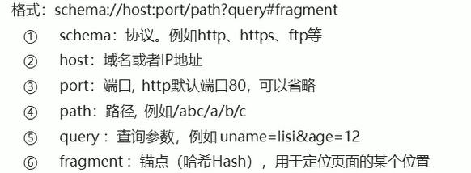
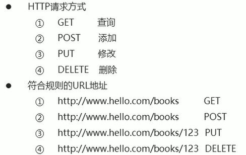
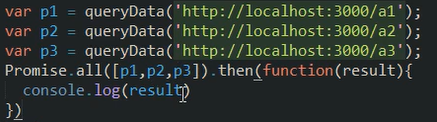
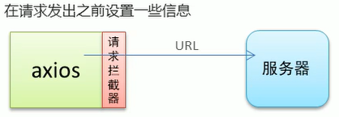
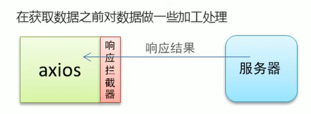

### 接口调用方式

操作 dom

1. 原生 ajax
2. 基于Jquery 的 ajax

基于 vue 不操作 dom

3. fetch
4. axios


**URL地址格式**



**Restful 风格的 URL**




### Promise 用法

ES6 引入的语法，异步编程

**异步调用**

1. 定时任务，setInterval、setTimeout
2. Ajax
3. 时间函数


使用 ajax 进行回调，如果需要保证顺序，则需要多层循环嵌套

```js
$.get({	//1
    url: '',
    success: function() {
                $.get({ //2
                    url: '',
                    success: function() {
                                    $.get({ //3
                                        url: '',
                                        success: function() {

                                        }
                                    })
                    }
                })
    }
})
```


Promise是异步编程的一种解决方案，从语法上讲，Promise 是一个对象，从它可以获取异步操作的消息。
使用Promise主要有以下好处:

1. 可以避免多层异步调用嵌套问题 （**回调地狱** https://www.cnblogs.com/wenxuehai/p/10455664.html）
2. Promise对象提供了简洁的 API，使得控制异步操作更加容易


typeof Promise

- function：catch、then

**承诺** 用法

1. ==实例化 Promise 对象==，构造函数中传递函数，该函数中用于处理异步任务
2. resolve 和 reject 两个参数用于处理成功和失败两种情况，并通过 ==p.then== 获取处理结果

```js
var p = new Promise(function(resolve, reject) {
    // 成功时调用 resolve
    // 失败时调用 reject
})
p.then(function(ret) {
    // 从 resolve 得到正常结果
}, function(ret) {
    // 从 reject 得到错误信息
})
```

简单使用：

```js
var p = new Promise(function (resolve, reject) {
    setTimeout(() => {
        var flag = false;
        if (flag) resolve('ok');
        else reject('fail');
    }, 2);
});

p.then(function (data) {
    console.log(data);
}, function (data) {
    console.log(data)
})
```


**基于 Promise 处理 Ajax 请求**

```js
function queryData(url) {
    var p = new Promise(function(resolve, reject) {
        var xhr = new XMLHttpRequest();
        xhr.onreadystatechanget = function() {
            if (xhr.readyState != 4) return;
            if (xhr.status == 200) resolve(xhr.responseText)
            else reject('error happened')
        }
        xhr.open('get', url)
        xhr.send(null)
    })
    return p;
}

queryData('http://localhost:3000/data')
	.then(function(data) {
	    console.log(data)
	}, function(data) {
    	console.log(data)
	})
```


**发送多个 ajax 请求，并且保证顺序的情况**

```js
queryData('http://localhost:3000/data')
	.then(function(data) { // 只处理成功的结果
	    console.log(data);
	    return queryData('http://localhost:3000/data') // 请求 2
	})
	.then(function(data) { // 处理请求 2
	    console.log(data);
	    return queryData('http://localhost:3000/data') // 请求 3
	})
	.then(function(data) { // 处理请求 3
	    console.log(data);
	})
```

代码可读性好，线性执行，解决了回调地狱的问题


**.then 参数中的函数返回值** ⭐

1. 返回 Promise 实例对象，对调用下一个 then

```js
queryData('')
	.then(function(data) {	// then 只进行一个处理，默认是成功的情况
    	return queryData('') // 2
	})
	.then(function(data) {	 // 处理 2 返回的 Promise 实例
    	return queryData('')
	})
	.then(function(data) {
    	return queryData('')
	})
```

2. 返回普通值，直接传给下一个 then。**默认创建一个新的 Promise 实例，保证下一个 then 的执行**

```js
queryData('')
	.then(function(data) {
    	return queryData('')
	})
	.then(function(data) {
    	return 'abc'	// 返回默认值，会默认创建一个 Promise 实例对其进行处理
	})
	.then(function(data) {
    	console.log(data) // abc
	})
```


### Promise 常用的 API

1. p.then() 得到异步任务的正确结果
2. p.catch() 获取异常信息
3. p.finally() 成功与否都会执行（尚且不是正式标准）

```js
queryData()
	.then(function(data) {
	})	
	.catch(function(data) {
	})	
	.finally(function() {
	})

// 等效于

queryData()
	.then(function(data) {
		}, function(data) {
	})	
	.finally(function() {
	})
```

使用 console.dir(Promise) 查看 Promise 内部结构

小实验

```js
function query() {
    return new Promise(function (a, b) {    // 方法参数无所谓，前后顺序决定回调函数是成功还是失败的
        // a('okk');
        // b('err');
        throw 'aaaerr'; // 模拟失败
    })
}

query()
    .then(function (info) {
        console.log(info)
    })
    .catch(function (info) {
        console.log(info)
    })
    .finally(function () {
        console.log('finished!')
    })
```


**Promise 对象方法**

1. Promise.all()  所有任务都完成才得到最终结果
2. Promise.race() 有一个任务完成就可以得到最终结果

```js
Promise.all([p1, p2, p3]).then((res) => {
    console.log(res)
})

Promise.race([p1, p2, p3]).then((res) => {
    console.log(res)
})
```




### fetch 用法

1. 更加简单的**数据获取**方式，功能更强大、灵活，可看作是 xhr 的升级版
2. 基于 Promise

语法结构：

```js
fetch(url).then(fn2)
	.then(fn3)
	...
    .catch(fn) // 错误处理
```

实例：

```js
fetch('http://localhost:3000/data')
    .then(data => {
        console.log(data)
        return data.text()
    }).then(data => {
        console.log(123)
        console.log(data)
    })
```


### fetch 请求参数

1. method(String)：请求方法，默认为 GET
2. body(String)：请求参数
3. headers(Object)：请求头，默认为 {}


==:warning: 前端使用使用同一种请求方法的不同形式请求后端，后端的处理方式可能也不同==

有 json格式、表单格式


GET 请求

```js
fetch('/abc?id=123')
	.then(data => {
    	return data.text()
	}).then(res => {
    console.log(res)
	})

fetch('/abc/123', {
    	method: "GET"
	})
	.then(data => {
    	return data.text()
	}).then(res => {
    console.log(res)
	})
```

DELETE 请求

```
fetch('/abc/123', {
    	method: "DELETE"
	})
	.then(data => {
    	return data.text()
	}).then(res => {
    console.log(res)
	})
```

POST 请求

```js
fetch('/abc/', {
    	method: "post",
    	body: "uname=lisi&age=22",
    	headers: {
            "Content-Type": "application/x-www-form-urlencoded"
        }
	})
	.then(data => {
    	return data.text()
	}).then(res => {
    console.log(res)
	})

fetch('/abc/', {
    	method: "post",
    	body: JSON.stringify({
            uname: 'zs',
            age: 22
        }),
    	headers: {
            "Content-Type": "application/json"
        }
	})
	.then(data => {
    	return data.text()
	}).then(res => {
    console.log(res)
	})
```

PUT 请求方式

```js
fetch('/abc/123', {
    	method: "put",
    	body: JSON.stringify({
            uname: "ww",
            age: 23
        })
    	headers: {
            "Content-Type": "application/x-www-form-urlencoded"
        }
	})
	.then(data => {
    	return data.text()
	}).then(res => {
    console.log(res)
	})

与post一样，也支持 body: "uname=lisi&age=22"
....
```


### fetch 响应结果

1. text()：将返回体处理成字符串类型
2. json()：返回结果和 JSON.parse(respText) 一样，相当于内部做了转换

```js
fetch('/user').then(data => {
    return data.json()
}).then(res => {
    console.log(res.name)
})

fetch('/user').then(data => {
    return data.text()
}).then(res => {
    var obj = JSON.parse(res)
    console.log(obj.name)
})
```


### axiox

https://github.com/axios/axios 基于 Promise 用于浏览器和 node.js 的 HTTP 客户端。

1. 支持浏览器和 node.js
2. 支持 Promise
3. ==能拦截请求和响应==
4. 自动转换 JSON 数据


```js
axio.get('http://localhost:3000/data').then(res => {
    return res.data // 注意，必须是 data 属性
})
```


### axios 常用 API

1. get：查询
2. post：添加
3. put：修改
4. delete：删除


**GET 请求**

params 选项可用来传递参数

```js
// 支持参数与 url 的拼接
axios.get('/user?id=123').then(res => {
    return res.data;
})

// 支持 restful 方式
axios.get('/user/123').then(res => {
    return res.data
})

// 使用 params 选项传递对象
axios.get('/user', {
    params: {
        id: 2
    }}).then(res => {
    	return res.data
	})

```

==:warning: 不同的方式后端的接收方式不同==

**DELETE 请求**

也可以使用 params 的形式传递参数，同 GET 方式有 3 种方式

使用 axios.delete()


**POST 请求**

```js
// 传递 json形式 的数据
axios.post('/user', {
    name: 'lisi',
    age: 22
}).then(res => {
    return res.data
})

// 传递 表单形式 的数据， name=jaja&age=28
var params = new URLSearchParams();
params.append('name', 'jaja');
params.append('age', '28')
axios.post('/user' params).then(res => {
    return res.data
})

```

**PUT 请求**

和 POST 非常类似

```js
axios.post('/user/123', {
    name: 'lisi',
    age: 22
}).then(res => {
    return res.data
})
```


### axios 的响应结果

响应结果的主要属性

1. data：响应回来的数据
2. headers：响应头信息
3. status：响应状态码
4. statusText：响应状态信息


```js
axios.get('/get').then(res => {
    console.log(res.data) // res.data.name
    console.log(res.headers)
    console.log(res.status)
    console.log(res.statusText)
})
```


### axios 全局配置

`axios.defaults.timeout = 3000;`

`axios.defaults.baseURL = 'http://localhost:3000/app'`  基地址，默认地址

`axios.defaults.headers['Authentication'] = 'asgasdgsj;qwetjpoiasdg'` 设hi请求头

```js
axios.defaults.baseURL = 'http://localhost:3000/app/';
axios.get('dat').then(res => {
    console.log(res.data)
})
```


### axios 拦截器


**请求拦截其**



```js
//添加一个请求拦截器
axios.interceptors.request.use(function(config) {
    console.log(config.url)
    config.header.mytoken = 'xxx'
    return config // // 一定要返回出去
}, function(err) {
    //处理相应的错误信息
})
```


**响应拦截器**



```js
axios.interceptors.response.use(function(res) {
    console.log(res)
    return res.data;// 一定要返回出去，返回 data 数据给 axios.get().then(res) 中的 res
}).then(function(err) {
    console.log(err)
})
```


### 接口调用 async / await 

之前使用 then 进行链式操作不够简洁

ES7 引入的语法，更加方便进行异步处理


1. async/await 是 `ES7` 引入的新语法，可以更加方便地进行异步操作
2. async 关键字用于函数上（async 函数的 **返回值是 Promise 实例对象**）
3. await 关键字用于 async 函数中（await 可以得到异步的结果）

```js
async functions queryData(id) {
    const res = await axios.get('/data')	// 使用 await 时就不用 then 了
    return res // 也可以 res.data 返回结果
}
var p = queryData(1).then(function(data){
	console.log(p.data)
})
```


```js
async function queryD () {
    var res = await new Promise(function(succ, err) {
        setTimeout(function() {
            succ('succccc')
        }, 10000)
    })
    return res // 返回 promise
}
queryD().then(function(data) {
    console.log(data)
})
```


### async/await 处理多个异步请求

await 保证处理的顺序

```js
axios.defaults.baseURL = 'http://localhost:3000'

async function queryData() {
    var info = await axios.get('as1')
    var res  = await axios.get('as2?info=' + info.data)
    return res.data
}

queryData().then(function(data) {
    console.log(data)
})
```


