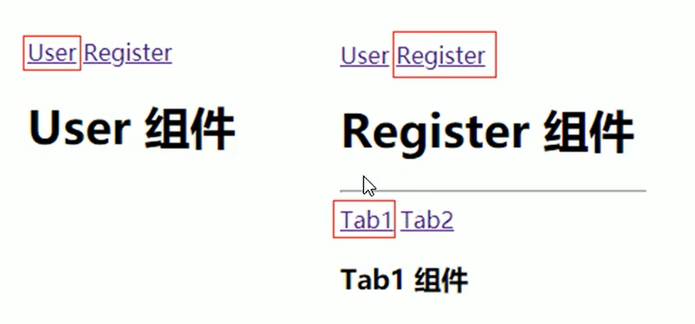

### 关于 \#

锚点链接、哈希属性 https://zhuanlan.zhihu.com/p/22795724

\# 是用来指导浏览器动作的，对服务器端完全无用。所以，HTTP请求中不包括#。

在第一个 # 后面出现的任何字符，都会被浏览器解读为位置标识符。这意味着，这些字符都不会被发送到服务器端。

http://www.example.com/index.html#print

改变井号后面的参数不会触发页面的重新加载但是会留下一个历史记录。仅改变井号后面的内容，只会使浏览器滚动到相应的位置，并不会重现加载页面。

可以通过 javascript 使用 window.location.hash 来改变井号后面的值，`window.location.hash` 这个属性可以对URL中的井号参数进行修改，基于这个原理，我们可以在不重载页面的前提下创造一天新的访问记录。

还可以监听hash值，当hash值变化时触发事件。

```js
addEventListener("hashchange", function () {
});
```


### Vue Router

router.vuejs.org/zh/


### 基操

1. 添加路由链接

router-link 标签是 vue 中提供的标签，默认会被渲染为 a 标签

to 属性会被渲染为 href 属性

to 属性的指默认会被渲染为 # 开头的 hash 地址

```html
<router-link to='/user'>User</router-link>
```

2. 添加路由填充位

router-view ，或叫 路由占位符

将来通过路由规则匹配的组件，将会被渲染到 router-view 所在的位置

```html
<router-view></router-view>
```

3. 配置路由规则并创建路由实例

routes 路由数组存放路由规则，其中至少包含 path 和 component

- path 表示当前路由规则匹配的 hash 地址
- component 表示当前路由规则对应要展示的组件

```js
// 创建路由实例对象
var router = new VueRouter({
    //routes是路由规则数组
    routes: [
        { path:'/user', component: User},
        { path:'/regster', component: Register},
    ]
})
```

4. 把路由挂载到 Vue 根实例中

```js
new Vue({
    el: '#app',
    router
})
```


**路由重定向**

路由重定向：访问 A 时，强制跳转到 C，从而展示特定的组件页面

通过路由规则的 redirect 属性，指定一个新的路由地址，可以很方便地设置路由的重定向

```js
var router = new VueRouter({
    routes: [
        { path: '/', redirect: '/user'},
        { path:'/user', component: User},
        { path:'/regster', component: Register},
    ]
})
```


### 嵌套路由

父级路由链接显示得模板内容中又有子级路由链接，点击子级路由链接显示子级模板内容



父级路由 /register 的模板

```js
const Register = {
    template: `<div>
        <h1>Register 组件<h1>
		<hr/>
		<router-link to="/register/tab1">Tab1></router-link>
		<router-link to="/register/tab2">Tab2></router-link>
		<!-- 子路由填充位 -->
		<router-view/>
      </div>`
}
```

定义路由规则，router-linker 中的 to 属性要和 路由配置中的 path 属性一一对应

```js
const router = new VueRouter({
    routes: [
        { path: '/user', component: User },
        { path: '/register', component: Register, 
        	children: [
                // children 下配置子路由链接
                { path: '/register/tab1', Compoennt: Tab1 },
                { path: '/register/tab2', Compoennt: Tab2 }
            ]
        }
    ]
})
```


### 动态路由匹配

有的情况下，路由规则的形式大致相同，可以进行简化

```html
<router-link to='/user/1'>User --> 1</router-link>
<router-link to='/user/2'>User --> 2</router-link>
<router-link to='/user/3'>User --> 3</router-link>

{ path: '/user/1', component: User }
{ path: '/user/2', component: User }
{ path: '/user/3', component: User }
```

使用 **:attr** 动态匹配，attr 表示路由参数，可用 **$route.params.attr** 获取

```js
const router = new VueRouter({
    routes: [
        { path: '/user/:id', component: User }
    ]
})

const User = {
    template: '<div>User {{ $route.params.id }}</div>'
}
```


### 路由组件传参

使用 $route 与对应的路由形成**高度耦合**，不够灵活，所以可以使用 props 将组件和路由解耦


1、路由规则中的 props 属性被设置为布尔值

```js
const router = new VueRouter({
    routes: [
        // 如果 props 被设置为 true，route.params 将会被设置位组件属性
        { path: '/user/:id', component: User, props: true }
    ]
})

const User = {
    props: ['id'], // 使用 props 数组接收路由参数
    template: '<div>User {{ id }}</div>' // 使用路由参数
}
```


2、路由规则中的 props 的值为对象属性

```js
const router = new VueRouter({
    routes: [
        // 如果 props 被设置为对象属性，其中的键即 uname, age 将会被设置位组件属性
        { path: '/user/:id', component: User, props: { uname: 'lili', age: 22 } }
    ]
})

const User = {
    props: ['uname', 'age'], // 使用 props 数组接收路由参数
    template: '<div>User - {{ id }} - {{ uname }} - {{ age }}</div>' // 使用路由参数
}
```

注意：此时路径 path 匹配中的 id 不能通过插值表达式获取，即 `{{ id }}`


3、路由规则中的 props 的值为函数类型，可以同时使用动态参数和静态参数

```js
const router = new VueRouter({
    routes: [
        // 如果 props 是一个函数，则这个函数接收 route 对象为自己的形参
        { path: '/user/:id', component: User, 
         	props: route => ({ uname: 'lili', age: 22, id: route.params.id }) }
    ]
})

const User = {
    props: ['uname', 'age'], // 使用 props 数组接收路由参数
    template: '<div>User - {{ id }} - {{ uname }} - {{ age }}</div>' // 使用路由参数
}
```


### 命名路由

给路由规则起别名，使用 name 定义路由的别名

```js
const router = new VueRouter({
    routes: [
        {
            path: '/user/:id',
            name: 'user',
            component: User
        }
    ]
})
```
使用 :to 绑定属性，即一个命名路由
```html
<router-link :to="{ name: 'user', params: { id: 123 } }"></router-link>
```


### 编程式导航

声明式导航，通过点击链接事先定义的链接，比如 a 标签、router-link 标签，这些都是事先定义的

编程式导航，通过调用 JS 的 API 实现导航的方式，比如 location.href='https://baidu.com'


- this.$router.push( 'hash地址' )
- this.$route.go(n)

```js
this.$router.push('/user')

this.$router.go(-1)  // 倒退到上个页面（先访问的）
this.$router.go(1)	 // 前进到下个页面（后访问的）
```


- route.push() 方法参数规则

```js
router.push('/home') // push(路径名)
router.push({ path: '/user' }) // 对象
router.push({ name: '/user', params: { userId: 1 } })  // 命名路由的方式，传递参数
router.push({ path: '/user', query: { uname: 'lily'}}) // 带查询参数，即 /user?uname=lily
```


