### npm i xxx 命令中 -S 还是 -D

-S：**dependencies**，这个则是需要发布到生产环境中的，就比如你要跑一个基于 vue 的项目，所以需要 vue.js 来支持，而这个 vue.js 文件就需要跟随项目到最终的生产环境

-D：**devDependencies** ，是我们开发的时候需要用到的一些包，只需要用于开发阶段，真正打包上线的时候并不需要这些包，因为这些工具只是你用来打包代码的，是用来识别特定文件以及代码，帮助我们生产最终文件的


### 模块化概述

传统开发

1. 命名冲突
2. 文件以来

模块化：功能模块化（功能细分到文件中），模块之间相互隔离，可以通过特定的接口公开内部成员，也可以依赖别的模块

好处：方便代码重用，提高开发效率，方便后期维护


模块化规范

1、浏览器端 AMD、CMD

2、服务器端中

1. CommonJS（**Node 默认支持**）
   1. 模块分为 单文件模块 和 包
   2. 模块成员导出：module.exports 和 exports
   3. 模块成员导入：require('模块标识符')

2. ES6 服务器端和浏览器端通用
   1. 每个 js 文件都是一个独立的模块
   2. **导入模块成员**使用 **imports** 关键字
   3. **暴露模块成员**使用 **exports** 关键字


### 通过 babel 体验 ES6规范

babel：原发转换工具

Node 平台默认支持 CommonJS 规范，想要在 Node 中体验高级的 ES6 特性，需要使用 babel 将高级的、有兼容性的 JS 代码转化为低级的、没有兼容性的 JS 代码

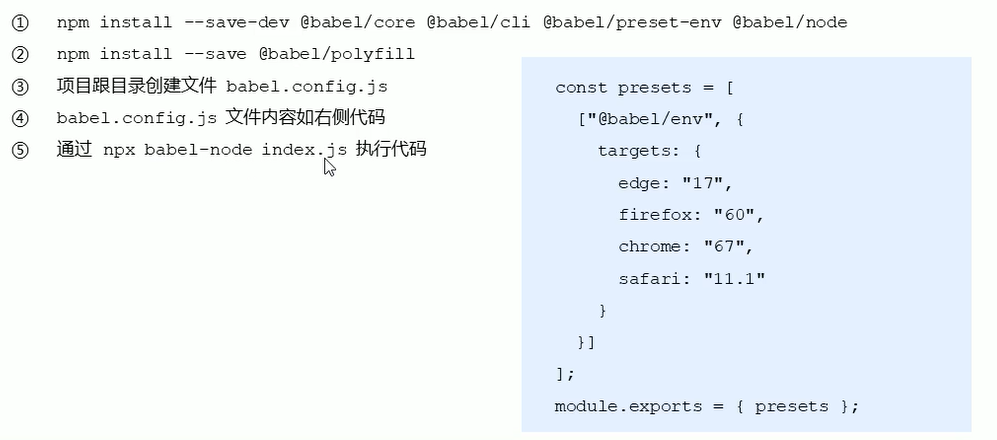

### ES6 模块化基本语法


### 默认导入导出


默认导出语法 **export default** 默认导出的成员

```js
// 当前文件模块时 m1.js

// 私有成员 a、c
let a = 10
let b = 20
// 外界访问不到，因为没有暴露出去
let d = 30

function show () {}

// 将本模块中的私有成员暴露出去，供其他模块使用
export default {
    a,
    c,
    show
}

```

默认导入语法

使用：**import** 接收名称 **from** '模块标识符'

```js
import m1 from './m1.js' // 导入模块成员

console.log(m1)
// 输出：{ a: 10, c: 20, show: [Function: show] }
```

注意1：每各模块中中允许使用唯一的一次 export default，否则会报错

注意2：如果模块中没有暴露任何成员（即不使用 export default），其他**模块导入时不报错**


### 按需导入导出


按需导出：`export let s1 = 10`

按需导入：`import { s1 } from '模块标识'`

```js
/* m1.js */
export let s1 = 'aaa'
export let s2 = 222
export let hello = function() {}
// 按需导出与默认导出不冲突
export default {
    a,b,c
}

/* m2.js */
import {s1, s2, hello} from './m1.js' // 按需导入
import m1 from './m1.js' // 默认导入
// 默认导入和按需导入同时存在不冲突
import m11,{s1 as s11, hello as hello11} from './m1.js' // a as b，为 a 起别名为 b

console.log(s1)
console.log(s2)
console.log(hello)

console.log(m1)
console.log(s11)
console.log(hello11)
```

总结：在一个模块中，最多只能用一次默认导出，但可以用多次按需导出


### 直接导入并执行模块代码

直接导入，不接收模块中的成员，省略 from 关键字

```js
/* m1.js */
console.log('I am m1')

/* m2.js */
import './m1.js' // 直接导入并执行代码
```


### webpack


**当前 Web 开发面临的困境**

1. 文件依赖关系错综复杂
2. 静态资源请求效率低
3. 模块化支持不友好
4. 浏览器对高级Javascript特性兼容程度较低
5. etc...


**webpack**

webpack 是一个流行的**前端项目构建工具(打包工具)**，可以解决当前web开发中所面临的困境。
webpack 提供了**友好的模块化支持**，以及**代码压缩混淆、处理 js 兼容问题、性能优化**等强大的功能，从而让程序员把工作的重心放到具体的功能实现上，提高了开发效率和项目的可维护性。

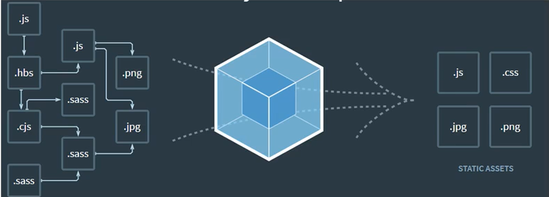


### webpack 基操

1、创建列表隔行变色项目

 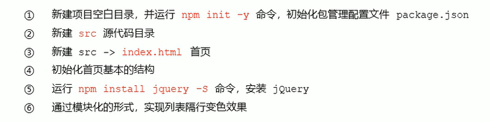


```js
/* index.js */
import $ from 'jquery'

$('li:odd').css('backgroundColor', 'pink')
$('li:even').css('backgroundColor', 'lightblue')
```

编写 ES6 风格的 js 代码，使用传统的方式导入 html 文件中不会生效，因为不兼容 ES6 风格

此时需要通过 webpack 进行兼容型转化


2、安装和使用 webpack

 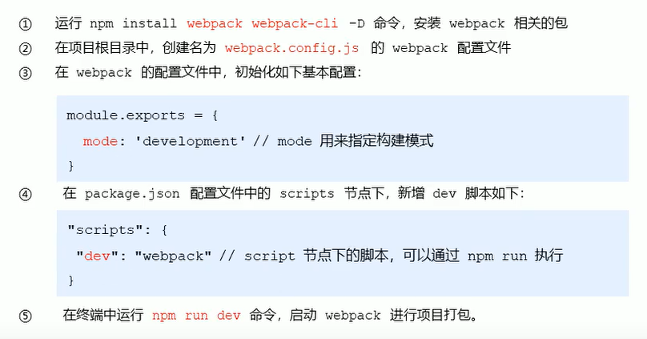

第③步，mode 表示构建模式，development 表示开发模式，不会进行代码的压缩混淆，速度快，还可以是 production 模式，表示生产模式，会进行压缩和混淆，速度慢


```js
import $ from 'jquery'

$(function () {
    $('li:odd').css('background-color', 'pink');
    $('li:even').css('background-color', 'lightblue');
})
```


### 配置打包的入口和出口


webpack 4.x

- 默认入口 src/index.js
- 默认出口 dist/main.js

修改：在 webpack.config.js 中

```js
const path = require('path') // 导入 node.js 中专门操作路径的模块
module.exports = {
    entry: path.join(__dirname, './src/index.js'), // 打包入口路径
    output: {
        path: path.join(__dirname, './dist'), // 输出文件存放路径
        filename: 'bundle.js'	// 输出文件名
    }
}
```


### webpack 自动打包功能 :warning:

 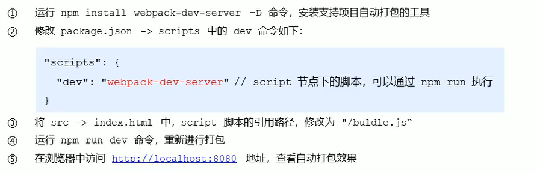

webpack-dev-server 会启动一个实时打包的 http 服务器

webpack-dev-server 打包生成的输出文件，默认放到了项目**根目录（注意是 / 开头的，表示根目录）**中，而且是虚拟的、看不见的（可访问） 

:white_check_mark: 包的版本可能影响程序运行！

 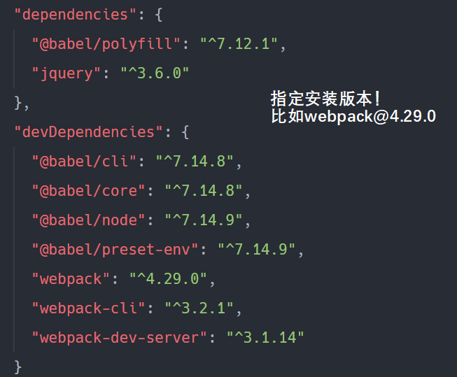

卸载包：`npm uninstall webpack`

安装指定版本的包：`npm i webpack@4.29.0 -D`


### webpack 生成预览页面

使用 html-webpack-plugin 生成预览页面

 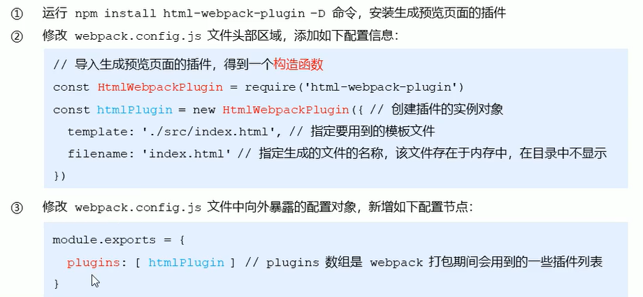

第③步，将 htmlplugin 实例放入 plugins 中暴露出去


### 配置打包的相关参数

自动打开浏览器，并请求 http://127.0.0.1:8888

```json
// package.json

"scripts": {
    "dev": "webpack-dev-server --open --host 127.0.0.1 --port 8888"
}
```


### webpack 中的加载器

**webpack 默认只能处理 .js 结尾的模块**，

非 .js 后缀结尾的模块，需要调用 loader 加载其才可以正常打爆，否则会报错


loader 加载其可以协助 webpack 打包处理特定的文件模块，比如

- less-loader 可以打包处理 .less 相关的文件
- sass-loader 可以打包处理 .scss 相关的文件
- url-loader 可以打包处理 css 中与 url 路径相关的文件

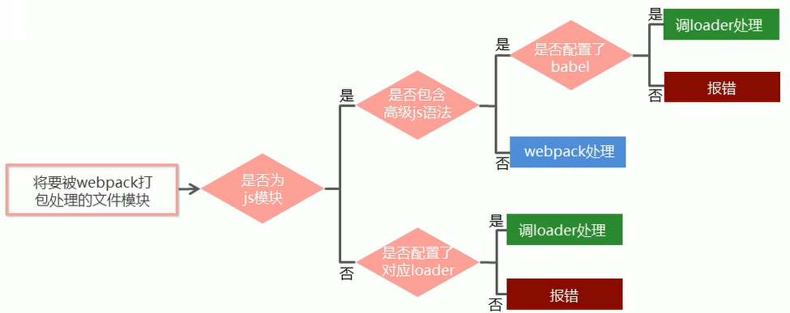

### 加载器的基本使用

```js
/* 1.css */
li {
	list-style: none;
}

/* index.js */
import $ from 'jquery'
import './css/1.css'

$(function () {
    $('li:odd').css('background-color', 'pink');
    $('li:even').css('background-color', 'lightblue');
})
```

打包失败，需要配置 .css 文件的加载器

 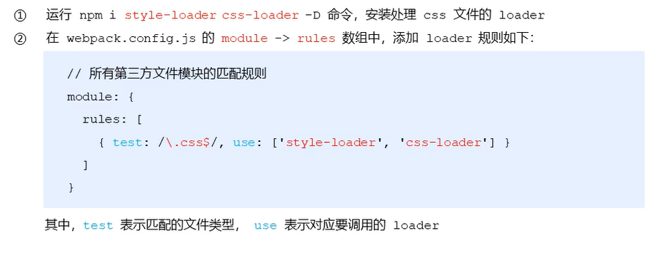

- use 数组指定的 loader 顺序是固定的
- 多个 loader 的调用顺序是 从后往前调用


### 打包处理 less 文件

whatisless：https://less.bootcss.com/ 给 css 加点料

 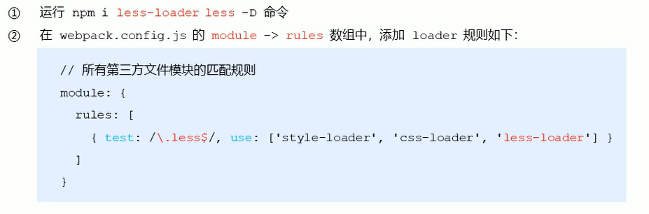


### 打包处理 sass 文件

whatissass https://www.sass.hk/docs/ 

 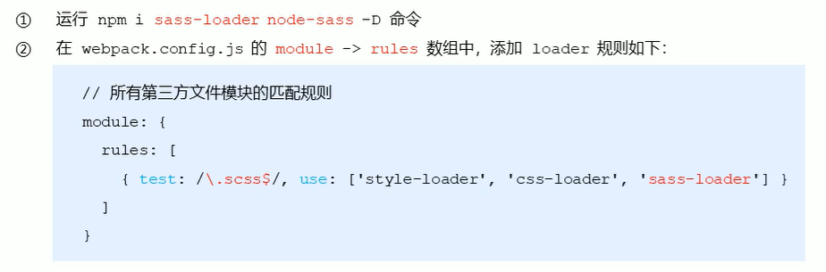


### 配置 postCSS 自动添加 css 的兼容前缀

兼容性问题，比如：

```css
::placeholder {
    color: red;
}
```

低版本浏览器不兼容，解决方案：

 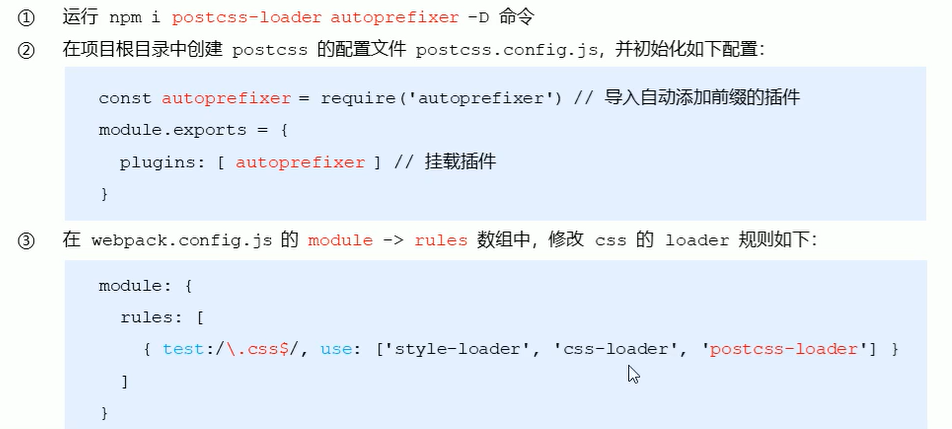


### 打包样式表中的图片和字体文件

```css
#box {
    width: 580px;
    height: 340px;
    background-color: pink;
    background: url(./imgs/1.jpg)
}
```

转换失败，文件类型需要配置 loader：

 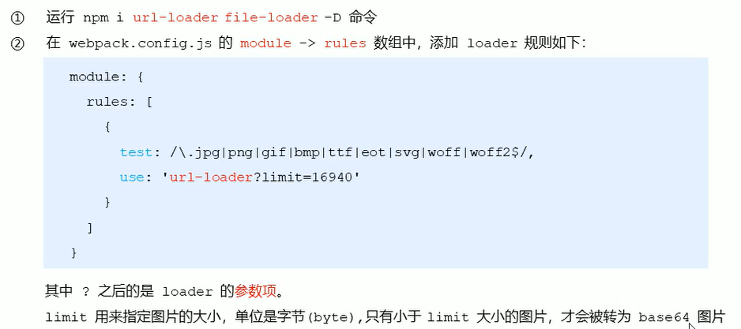

使用 base64 图片加载更快


### 打包处理 js 的高级语法

```js
/* index.js */
class Person {
    static info = 'aaa';
}
console.log(Person.info)
```

JS 高级用法需要进行转化：

 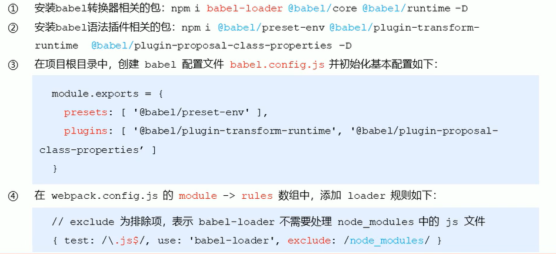


### Vue 单文件组件

传统组件问题

1. 全局定义的组件必须保证组件的名称不重复
2. 字符串模板缺乏语法高亮，在 HTML 有多行的时候，需要用到丑陋的
3. 不支持 CSS 意味着当 HTML 和 JavaScript 组件化时，CSS 明显被遗漏
4. 没有构建步骤限制，只能使用 HTML 和 ES5 JavaScript ，而不能使用预处理器（如：Babel)

解决方案

Vue ：使用单文件组件


组成结构：

1. template 组件的模板区域
2. script 业务逻辑区域
3. style 样式区域

```vue
<template>
	// 定义组件的模板内容
</template>

<script>
    // 定义业务逻辑
	export default {
        data() {
            return {
                "msg": "check check now!"
            }
        },
        methods: {
            
        }
    }
</script>

<style scoped>
	// 定义样式 
</style>
```

注意：style 标签尽量添加 scope 属性，保证组件样式私有，不影响其他组件


### 配置 Vue 文件的加载器

 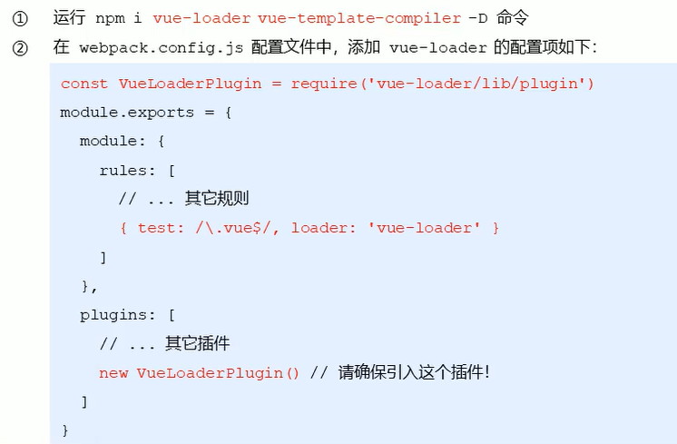


### webpack 项目中使用 vue

 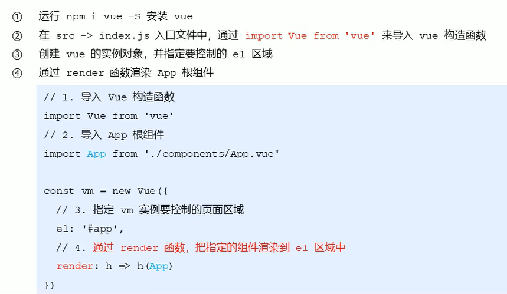

```html
需要渲染的部分
<div id="app"></div>
```

注意：:warning: 在 webpack 项目中，最好使用 render 来渲染页面，template 或者 component 的方式可能会失效


### webpack 打包和发布

在 package.json 中添加配置项

```json
"scripts": {
    "build": "webpack -p"
}
```

使用 `npm run build` 命令


